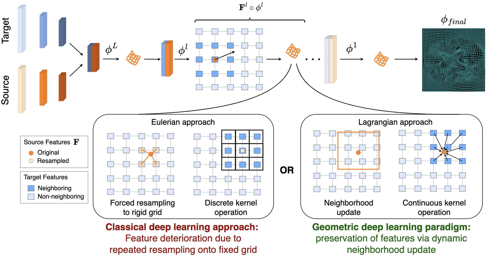

# Image registration is a geometric deep learning task
Welcome!

This repository contains code for Image registration is a geometric deep learning task paper submitted to NeuRIPS 2024.



## Qualitative results

Result demonstrating how our method not can handle not only large roations but also deformble components in the image registration task.


## Installation
1. Clone this repository
2. In a fresh Python 3.10.x virtual environment, install dependencies by running:
    ```
    pip install -r <path_to_cloned_repository>/requirements.txt
    ```

## Training your own model


### Run a single training
To train the default model on your own data:
```
python main.py train -c <path_to_config_file>
```

Training logs and outputs will be saved in `ckpt/train/DATE/TIME/`.
On default settings, a checkpoint of the model will be saved at `ckpt/train/DATE/TIME/checkpoints/last.ckpt`
A copy of the configurations will be saved to `ckpt/train/DATE/TIME/config.yaml` automatically.


## Inference/Testing
To run inference of a trained model,
```
python main.py eval -cp <path_to_model_checkpoint> -c <path_to_config_file>
```


## Data
You can find the NLST dataset used in our paper at:
 - [NLST](https://learn2reg.grand-challenge.org/)

Unfortunately, we are not allowed to share the original or processed data that we used in the paper directly due to limitations on redistribution put in place by the original data distributor. But you can apply to download these data at:
- [CamCAN](https://camcan-archive.mrc-cbu.cam.ac.uk/dataaccess/)

We also encourage you to try our framework on other applicable and accessible open datasets, and share your findings!


## Contact Us
If you have any question or need any help running the code, feel free to open an issue or email us at:
[Vasiliki Sideri-Lampretsa](mailto:vasiliki.sideri-lampretsa@tum.de),
[Nil Stolt Anso](mailto:ge74vos@mytum.de)


